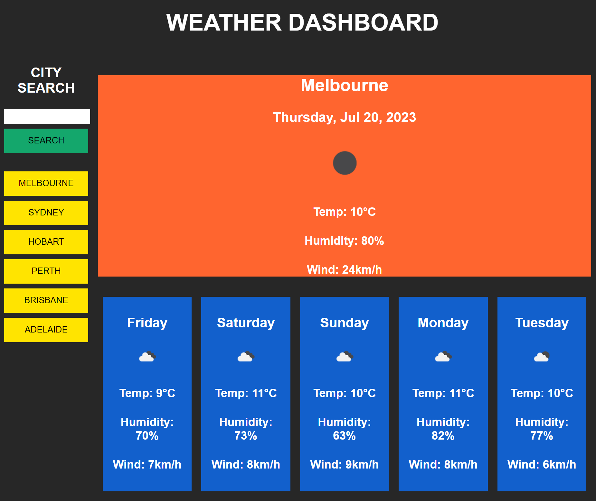

# weather-dashboard

For the week-six challenge my task was to utilise multiple server-side APIs, provided from OpenWeather, to construct a dynamically populated weather dashboard that can provide multi-day weather conditions for multiple cities. The weather dashboard should have the following features: A search input to retrieve the weather outlook of a given city; all searched-for cities are to be saved to a search history sidebar for easy access; searching for, or clicking on a city in the sidebar will present the user with the current weather and five-day forecast for a given city, including temperature, wind speed and humidity.

All HTML, CSS, and JavaScript code for the application, as shown below, was of my own design.

## Associated links:

Repo:
https://github.com/higgdan/weather-dashboard

Application:
https://higgdan.github.io/weather-dashboard/